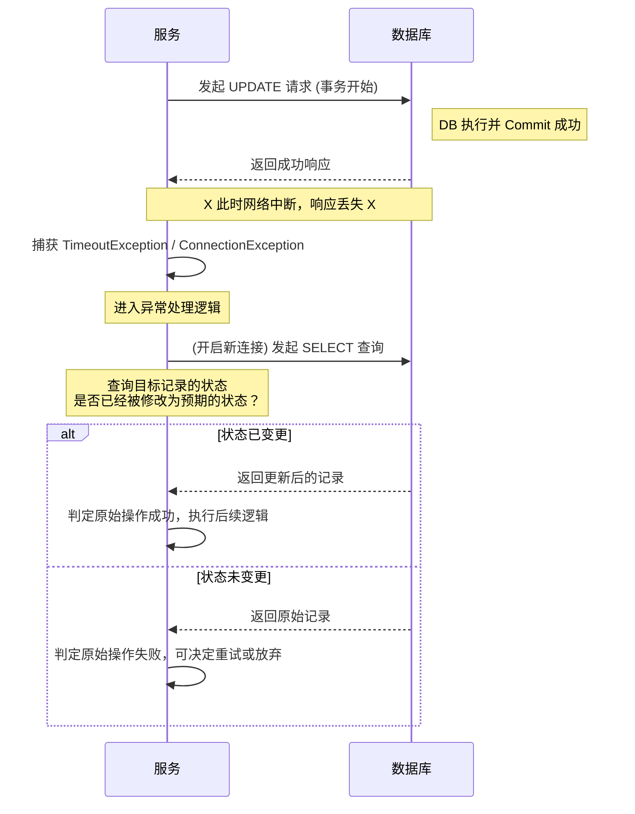

## Ask 

```
事务的状态，在一个springboot+mysql的架构中，服务请求update数据库，获取到update成功的响应然后执行后续业务逻辑。问当数据库重启，或者网络抖动，服务请求看到请求失败。数据库可能执行任务成功/失败，那么服务请求该如何判定这个请求是成功或失败。服务会主动回滚之前的事务么？
```

## 🤖 Assistant

<div style="border: 2px solid #dddddd; border-radius: 10px;">
  <details style="padding: 5px;">
    <summary>已深度思考</summary>
    **Clarifying the Scenario**<br><br>I'm currently focused on deconstructing the user's query, specifically the "happy path" where a Spring Boot service updates a MySQL database. I'm starting to visualize the typical transaction flow. The next step is outlining the various states a transaction can go through, considering the happy path.<br><br><br>**Refining the Approach**<br><br>I'm now fully immersed in the role of a Principal Backend Architect. The user's query about transaction ambiguity in Spring Boot with MySQL demands a comprehensive response. I'm focusing on the "why" and "how" behind the issue. I'm exploring various architectural patterns and trade-offs to ensure a robust and long-term solution. This necessitates a clear, structured explanation addressing the core challenges.<br><br><br>**Examining Transaction States**<br><br>I'm now diving into the precise states a transaction undergoes within the happy path. Considering network interruptions and MySQL's behavior is critical. Exploring the transaction's lifecycle from the initial request through potential commit, rollbacks, or uncertainty. This necessitates a thorough analysis of how Spring's `@Transactional` interacts with the underlying database to fully address the user's issue.<br><br><br>**Evaluating the Trade-offs**<br><br>I've been analyzing the pros and cons of different solutions, starting with the simple retry and highlighting why it fails. Now, I am exploring more complex patterns like idempotency, query state, and distributed transactions. My focus is on providing a range of options, each with its own advantages and drawbacks, to offer a comprehensive architect's perspective.<br><br><br>**Evaluating Further Solutions**<br><br>I'm now exploring the proactive state query approach in more detail. I'm focusing on clarifying the specific benefits and trade-offs. I also need to provide concrete examples, likely using a sequence diagram, to illustrate the precise steps. My goal is to outline all possible cases and provide a robust method to handle them consistently. I am thinking through the retry mechanisms and failure scenarios.<br><br><br>**Revising Solution Approaches**<br><br>I'm now refining the solution descriptions.  I'm focusing on the practical implications of idempotency and the proactive state query, clarifying the implementation details. I'm ensuring the user understands both the advantages and the potential complexities of each strategy. I'm working to provide a sequence diagram for the proactive approach to better explain this, and I'm currently assessing the implementation complexity and the trade-offs of these options.<br><br><br>**Developing Solution Framework**<br><br>I'm now formulating a comprehensive solution framework. This encompasses strategies ranging from idempotency to asynchronous eventing for this Spring Boot and MySQL scenario. I'm focusing on creating a decision tree to help the user choose the best approach based on their specific requirements.<br><br><br>**Evolving Solution Strategies**<br><br>I am now focusing on designing a framework, starting with idempotency, which might not be enough. Then, I am developing the solution for querying the transaction state. I am creating a decision-making guide to assist the user in choosing the most effective technique based on their unique requirements.<br><br><br>
  </details>
</div>

您好，您提出的这个问题是分布式系统中一个非常经典且核心的难题，通常被称为“请求在疑”（In-Doubt Request）或“不确定状态”问题。作为架构师，我可以告诉您，这是我们在设计任何有状态服务时都必须优先考虑的场景。

首先，我来直接回答您的最后一个问题：

> 服务会主动回滚之前的事务么？

**不会。**

原因在于，当服务（客户端）与数据库之间的连接因网络抖动或数据库重启而中断时，服务端的 `TransactionManager` (在Spring中) 会捕获到一个异常（如 `CommunicationsException`, `TimeoutException` 等）。此时，对于服务来说，它与数据库的会话（Session）已经丢失，事务上下文也随之销毁。它失去了与数据库“沟通”的能力，因此**无法**再向数据库发送 `ROLLBACK` 或 `COMMIT` 指令。它唯一能做的就是向上层业务代码抛出异常。

### 问题的核心：状态不一致

此时，系统处于一个危险的不一致状态：

* **服务视角**：操作失败了。它会记录错误日志，可能会向上游返回失败响应。
* **数据库视角**：操作可能是成功的，也可能是失败的。
 * **可能成功**：数据库收到了 `UPDATE` 请求，成功执行并**已提交 (Committed)**，只是在返回成功响应的途中网络断开了。
 * **可能失败**：请求在网络中丢失，从未到达数据库；或者数据库接收后在执行或提交前宕机，事务被自动回滚。

那么，服务该如何判定最终状态并确保数据一致性呢？这正是架构设计的关键所在。简单的“失败后重试”是绝对不可取的，因为它可能导致业务操作被重复执行（例如，重复扣款）。

以下是几种业界成熟的解决方案，按推荐程度和复杂度递增排列：

---

### 方案一：核心思想——幂等性设计 (Idempotency)

这是最重要、也是最优先推荐的解决方案。幂等性是指对同一个操作执行一次和执行多次，所产生的影响是完全相同的。如果您的`UPDATE`操作是幂等的，那么即使简单重试也是安全的。

**如何实现幂等性：**

1. **唯一业务ID / 请求ID**：
 * **机制**：在服务发起请求时，生成一个全局唯一的请求ID（例如，使用UUID或雪花算法）。将这个ID与业务操作一同提交给数据库。
 * **数据库设计**：在相关表中增加一个 `request_id` 字段，并为其建立唯一索引 (`UNIQUE KEY`)。
 * **业务逻辑**：
 * 不再是简单的 `UPDATE`，而是先通过 `request_id` 查询操作是否已被执行。
 * 或者，利用数据库的特性，例如创建一个“操作记录表”，每次操作前先 `INSERT` 这条带唯一 `request_id` 的记录。如果插入成功，则执行业务逻辑；如果因唯一键冲突而失败，说明操作已执行，直接返回成功。

 **伪代码示例：**
```java
    // Controller Layer
    public Response performUpdate(String orderId, String requestId) {
        try {
            updateService.process(orderId, requestId);
            return Response.success();
        } catch (Exception e) {
            // 当出现网络抖动等异常时
            boolean isSuccess = checkStatusService.isOperationSucceeded(requestId);
            if (isSuccess) {
                return Response.success(); // 虽然本次调用失败，但查询后发现操作已成功
            } else {
                return Response.failure("Operation failed");
            }
        }
    }

    // Service Layer
    @Transactional
    public void process(String orderId, String requestId) {
        // 1. 插入操作记录，利用唯一键防止重复
        operationLogRepository.insert(new OperationLog(requestId, orderId, "PROCESSING"));

        // 2. 执行核心业务更新
        orderRepository.updateStatus(orderId, "PAID");
    }
```

2.  **状态机与版本号（乐观锁）**：
    *   **机制**：在要更新的表上增加一个 `version` 字段。
    *   **业务逻辑**：`UPDATE` 操作变为 `UPDATE my_table SET status = 'new_status', version = version + 1 WHERE id = ? AND version = ?`。
    *   **处理流程**：当第一次请求成功但响应丢失时，`version` 已经改变。服务侧因超时而重试时，会带着旧的 `version` 值去执行 `UPDATE`，此时 `WHERE` 条件不满足，`UPDATE` 的影响行数为0。服务便可知道之前的操作很可能已经成功了。

---

### 方案二：主动查询回溯 (Proactive Querying)

这是一种在异常处理块中解决“不确定状态”的直接方法。

**处理流程：**



**优点**：逻辑清晰，实现相对简单。
**缺点**：
* 在异常处理中增加了额外的数据库查询，增加了故障恢复的延迟。
* 需要业务逻辑能明确地通过查询来判断操作是否成功。

---

### 方案三：分布式事务协调器或最终一致性方案

当业务流程非常复杂，跨越多个服务或数据库时，上述方案可能不足以应对。此时需要引入更宏观的架构模式。

1. **事务消息（以RocketMQ为例）**：
 * **机制**：利用消息队列的事务消息功能。
 * **流程**：
 1. 服务先向 MQ 发送一个“半消息”（Prepare Message）。
 2. 如果半消息发送成功，服务再执行本地数据库事务。
 3. 根据本地事务的结果，服务再向 MQ 发送 `COMMIT` 或 `ROLLBACK`。
 4. 如果第3步因服务宕机等原因失败，MQ 会定期回调服务，查询本地事务的最终状态，以决定是提交还是回滚该消息。
 * **适用场景**：适用于需要确保本地操作与消息发送原子性的场景。

2. **Transactional Outbox 模式**：
 * **机制**：这是实现可靠事件发布的黄金标准，也是最终一致性的核心模式之一。
 * **流程**：
 1. 在**同一个本地事务**中，既更新业务表，又向一个 `outbox`（发件箱）表中插入一条事件记录。
 2. 由于这是单个本地事务，因此业务数据更新和事件插入具有原子性。
 3. 一个独立的、可靠的**中继进程**（Relay Process）会持续扫描 `outbox` 表，将事件发布到消息队列（如 Kafka）。
 4. 发布成功后，更新或删除 `outbox` 表中的记录。
 * **优点**：完全解耦了业务逻辑和消息发布，非常可靠，是微服务架构中的首选。

### 总结与架构师建议

| 方案 | 复杂度 | 适用场景 | 关键优势 |
| :--- | :--- | :--- | :--- |
| **幂等性设计** | 低 | **绝大多数单体或简单微服务场景** | 从根本上解决重复操作问题，健壮且优雅 |
| **主动查询回溯** | 中 | 需要快速、同步地确认状态的简单场景 | 逻辑直接，易于理解和实现 |
| **分布式事务/最终一致性** | 高 | 跨多个服务的复杂业务流程 | 提供跨服务的数据一致性保证，可靠性极高 |

作为架构师，我的建议是：

1. **将幂等性作为服务接口设计的第一原则**。无论是否预见到网络问题，所有执行状态变更的写操作（`POST`, `PUT`, `DELETE`）都应设计为幂等的。这是构建健壮系统的基石。
2. 对于简单的、可同步确认的场景，**主动查询回溯**是一个可以接受的辅助手段。
3. 当你的系统演进到微服务架构，涉及跨服务的数据一致性时，请务必采用**Transactional Outbox**或**事务消息**这类最终一致性模式，避免使用重量级的两阶段提交（2PC）等强一致性分布式事务，因为它们对系统性能和可用性的影响太大。

通过上述设计，即使面对网络抖动、数据库重启等不稳定因素，您的系统也能保持数据的最终一致性。
