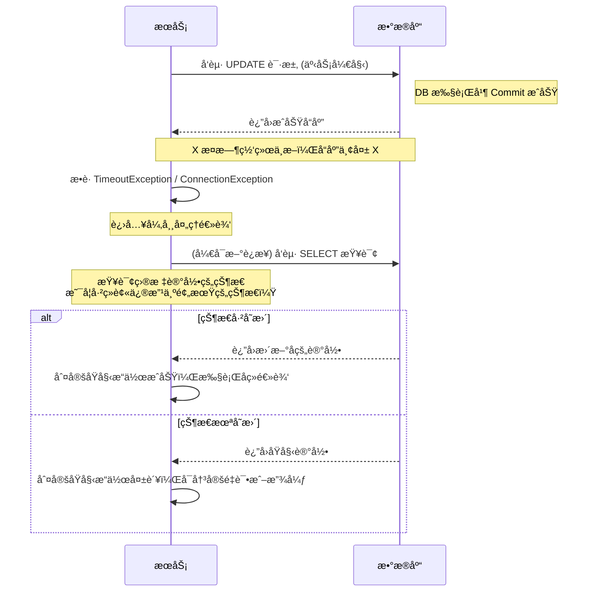

## Ask 

```
事务的状æ€ï¼Œåœ¨ä¸€ä¸ªspringboot+mysqlçš„æ¶æ„中，æœåŠ¡è¯·æ±‚updateæ•°æ®åº“，è·å–到updateæˆåŠŸçš„å“应然å执行å续业务逻辑。问当数æ®åº“é‡å¯ï¼Œæˆ–者网络抖动，æœåŠ¡è¯·æ±‚看到请求失败。数æ®åº“å¯èƒ½æ‰§è¡Œä»»åŠ¡æˆåŠŸ/失败，那么æœåŠ¡è¯·æ±‚该如何判定这个请求是æˆåŠŸæˆ–失败。æœåŠ¡ä¼šä¸»åŠ¨å›æ»šä¹‹å‰çš„事务么？
```

## 🤖 Assistant

<div style="border: 2px solid #dddddd; border-radius: 10px;">
  <details style="padding: 5px;">
    <summary>已深度æ€è€ƒ</summary>
    **Clarifying the Scenario**<br><br>I'm currently focused on deconstructing the user's query, specifically the "happy path" where a Spring Boot service updates a MySQL database. I'm starting to visualize the typical transaction flow. The next step is outlining the various states a transaction can go through, considering the happy path.<br><br><br>**Refining the Approach**<br><br>I'm now fully immersed in the role of a Principal Backend Architect. The user's query about transaction ambiguity in Spring Boot with MySQL demands a comprehensive response. I'm focusing on the "why" and "how" behind the issue. I'm exploring various architectural patterns and trade-offs to ensure a robust and long-term solution. This necessitates a clear, structured explanation addressing the core challenges.<br><br><br>**Examining Transaction States**<br><br>I'm now diving into the precise states a transaction undergoes within the happy path. Considering network interruptions and MySQL's behavior is critical. Exploring the transaction's lifecycle from the initial request through potential commit, rollbacks, or uncertainty. This necessitates a thorough analysis of how Spring's `@Transactional` interacts with the underlying database to fully address the user's issue.<br><br><br>**Evaluating the Trade-offs**<br><br>I've been analyzing the pros and cons of different solutions, starting with the simple retry and highlighting why it fails. Now, I am exploring more complex patterns like idempotency, query state, and distributed transactions. My focus is on providing a range of options, each with its own advantages and drawbacks, to offer a comprehensive architect's perspective.<br><br><br>**Evaluating Further Solutions**<br><br>I'm now exploring the proactive state query approach in more detail. I'm focusing on clarifying the specific benefits and trade-offs. I also need to provide concrete examples, likely using a sequence diagram, to illustrate the precise steps. My goal is to outline all possible cases and provide a robust method to handle them consistently. I am thinking through the retry mechanisms and failure scenarios.<br><br><br>**Revising Solution Approaches**<br><br>I'm now refining the solution descriptions.  I'm focusing on the practical implications of idempotency and the proactive state query, clarifying the implementation details. I'm ensuring the user understands both the advantages and the potential complexities of each strategy. I'm working to provide a sequence diagram for the proactive approach to better explain this, and I'm currently assessing the implementation complexity and the trade-offs of these options.<br><br><br>**Developing Solution Framework**<br><br>I'm now formulating a comprehensive solution framework. This encompasses strategies ranging from idempotency to asynchronous eventing for this Spring Boot and MySQL scenario. I'm focusing on creating a decision tree to help the user choose the best approach based on their specific requirements.<br><br><br>**Evolving Solution Strategies**<br><br>I am now focusing on designing a framework, starting with idempotency, which might not be enough. Then, I am developing the solution for querying the transaction state. I am creating a decision-making guide to assist the user in choosing the most effective technique based on their unique requirements.<br><br><br>
  </details>
</div>

您好，您æ出的这个问题是分布å¼ç³»ç»Ÿä¸­ä¸€ä¸ªé常ç»å…¸ä¸”核心的难题，通常被称为“请求在疑â€ï¼ˆIn-Doubt Request）或“ä¸ç¡®å®šçŠ¶æ€â€é—®é¢˜ã€‚作为æ¶æ„师，我å¯ä»¥å‘Šè¯‰æ‚¨ï¼Œè¿™æ˜¯æˆ‘们在设计任何有状æ€æœåŠ¡æ—¶éƒ½å¿…须优先考虑的场景。

首先，我æ¥ç›´æ¥å›ç­”您的最å一个问题：

> æœåŠ¡ä¼šä¸»åŠ¨å›æ»šä¹‹å‰çš„事务么？

**ä¸ä¼šã€‚**

åŸå› åœ¨äºï¼Œå½“æœåŠ¡ï¼ˆå®¢æˆ·ç«¯ï¼‰ä¸æ•°æ®åº“之间的è¿æ¥å› ç½‘络抖动或数æ®åº“é‡å¯è€Œä¸­æ–­æ—¶ï¼ŒæœåŠ¡ç«¯çš„ `TransactionManager` (在Spring中) 会æ•è·åˆ°ä¸€ä¸ªå¼‚常（如 `CommunicationsException`, `TimeoutException` 等）。此时，对äºæœåŠ¡æ¥è¯´ï¼Œå®ƒä¸æ•°æ®åº“的会è¯ï¼ˆSession）已ç»ä¸¢å¤±ï¼Œäº‹åŠ¡ä¸Šä¸‹æ–‡ä¹Ÿéšä¹‹é”€æ¯ã€‚它失å»äº†ä¸æ•°æ®åº““沟通â€çš„能力，因此**无法**å†å‘æ•°æ®åº“å‘é€ `ROLLBACK` 或 `COMMIT` 指令。它唯一能åšçš„就是å‘上层业务代ç æŠ›å‡ºå¼‚常。

### 问题的核心：状æ€ä¸ä¸€è‡´

此时，系统处äºä¸€ä¸ªå±é™©çš„ä¸ä¸€è‡´çŠ¶æ€ï¼š

* **æœåŠ¡è§†è§’**：æ“作失败了。它会记录错误日志，å¯èƒ½ä¼šå‘上游返å›å¤±è´¥å“应。
* **æ•°æ®åº“视角**：æ“作å¯èƒ½æ˜¯æˆåŠŸçš„，也å¯èƒ½æ˜¯å¤±è´¥çš„。
 * **å¯èƒ½æˆåŠŸ**：数æ®åº“收到了 `UPDATE` 请求，æˆåŠŸæ‰§è¡Œå¹¶**å·²æ交 (Committed)**，åªæ˜¯åœ¨è¿”å›æˆåŠŸå“应的途中网络断开了。
 * **å¯èƒ½å¤±è´¥**：请求在网络中丢失，ä»æœªåˆ°è¾¾æ•°æ®åº“；或者数æ®åº“æ¥æ”¶å在执行或æ交å‰å®•æœºï¼Œäº‹åŠ¡è¢«è‡ªåŠ¨å›æ»šã€‚

那么，æœåŠ¡è¯¥å¦‚何判定最终状æ€å¹¶ç¡®ä¿æ•°æ®ä¸€è‡´æ€§å‘¢ï¼Ÿè¿™æ­£æ˜¯æ¶æ„设计的关键所在。简å•çš„“失败åé‡è¯•â€æ˜¯ç»å¯¹ä¸å¯å–的，因为它å¯èƒ½å¯¼è‡´ä¸šåŠ¡æ“作被é‡å¤æ‰§è¡Œï¼ˆä¾‹å¦‚，é‡å¤æ‰£æ¬¾ï¼‰ã€‚

以下是几ç§ä¸šç•Œæˆç†Ÿçš„解决方案，按æ¨è程度和å¤æ‚度递å¢æ’列：

---

### 方案一：核心æ€æƒ³â€”—幂等性设计 (Idempotency)

这是最é‡è¦ã€ä¹Ÿæ˜¯æœ€ä¼˜å…ˆæ¨è的解决方案。幂等性是指对åŒä¸€ä¸ªæ“作执行一次和执行多次，所产生的影å“是完全相åŒçš„。如æœæ‚¨çš„`UPDATE`æ“作是幂等的，那么å³ä½¿ç®€å•é‡è¯•ä¹Ÿæ˜¯å®‰å…¨çš„。

**如何å®ç°å¹‚等性：**

1. **唯一业务ID / 请求ID**：
 * **机制**：在æœåŠ¡å‘起请求时，生æˆä¸€ä¸ªå…¨å±€å”¯ä¸€çš„请求ID（例如，使用UUID或雪花算法）。将这个IDä¸ä¸šåŠ¡æ“作一åŒæ交给数æ®åº“。
 * **æ•°æ®åº“设计**：在相关表中å¢åŠ ä¸€ä¸ª `request_id` 字段，并为其建立唯一索引 (`UNIQUE KEY`)。
 * **业务逻辑**：
 * ä¸å†æ˜¯ç®€å•çš„ `UPDATE`，而是先通过 `request_id` 查询æ“作是å¦å·²è¢«æ‰§è¡Œã€‚
 * 或者，利用数æ®åº“的特性，例如创建一个“æ“作记录表â€ï¼Œæ¯æ¬¡æ“作å‰å…ˆ `INSERT` è¿™æ¡å¸¦å”¯ä¸€ `request_id` 的记录。如æœæ’å…¥æˆåŠŸï¼Œåˆ™æ‰§è¡Œä¸šåŠ¡é€»è¾‘；如æœå› å”¯ä¸€é”®å†²çªè€Œå¤±è´¥ï¼Œè¯´æ˜æ“作已执行，直æ¥è¿”å›æˆåŠŸã€‚

 **伪代ç ç¤ºä¾‹ï¼š**
```java
    // Controller Layer
    public Response performUpdate(String orderId, String requestId) {
        try {
            updateService.process(orderId, requestId);
            return Response.success();
        } catch (Exception e) {
            // 当出ç°ç½‘络抖动等异常时
            boolean isSuccess = checkStatusService.isOperationSucceeded(requestId);
            if (isSuccess) {
                return Response.success(); // 虽然本次调用失败，但查询åå‘ç°æ“作已æˆåŠŸ
            } else {
                return Response.failure("Operation failed");
            }
        }
    }

    // Service Layer
    @Transactional
    public void process(String orderId, String requestId) {
        // 1. æ’å…¥æ“作记录，利用唯一键防止é‡å¤
        operationLogRepository.insert(new OperationLog(requestId, orderId, "PROCESSING"));

        // 2. 执行核心业务更新
        orderRepository.updateStatus(orderId, "PAID");
    }
```

2.  **状æ€æœºä¸ç‰ˆæœ¬å·ï¼ˆä¹è§‚é”）**：
    *   **机制**：在è¦æ›´æ–°çš„表上å¢åŠ ä¸€ä¸ª `version` 字段。
    *   **业务逻辑**：`UPDATE` æ“作å˜ä¸º `UPDATE my_table SET status = 'new_status', version = version + 1 WHERE id = ? AND version = ?`。
    *   **处ç†æµç¨‹**：当第一次请求æˆåŠŸä½†å“应丢失时，`version` å·²ç»æ”¹å˜ã€‚æœåŠ¡ä¾§å› è¶…时而é‡è¯•æ—¶ï¼Œä¼šå¸¦ç€æ—§çš„ `version` 值å»æ‰§è¡Œ `UPDATE`，此时 `WHERE` æ¡ä»¶ä¸æ»¡è¶³ï¼Œ`UPDATE` çš„å½±å“行数为0。æœåŠ¡ä¾¿å¯çŸ¥é“之å‰çš„æ“作很å¯èƒ½å·²ç»æˆåŠŸäº†ã€‚

---

### 方案二：主动查询å›æº¯ (Proactive Querying)

这是一ç§åœ¨å¼‚常处ç†å—中解决“ä¸ç¡®å®šçŠ¶æ€â€çš„ç›´æ¥æ–¹æ³•ã€‚

**处ç†æµç¨‹ï¼š**



**优点**：逻辑清晰，å®ç°ç›¸å¯¹ç®€å•ã€‚
**缺点**：
* 在异常处ç†ä¸­å¢åŠ äº†é¢å¤–çš„æ•°æ®åº“查询，å¢åŠ äº†æ•…éšœæ¢å¤çš„延迟。
* 需è¦ä¸šåŠ¡é€»è¾‘能æ˜ç¡®åœ°é€šè¿‡æŸ¥è¯¢æ¥åˆ¤æ–­æ“作是å¦æˆåŠŸã€‚

---

### 方案三：分布å¼äº‹åŠ¡å调器或最终一致性方案

当业务æµç¨‹é常å¤æ‚，跨越多个æœåŠ¡æˆ–æ•°æ®åº“时，上述方案å¯èƒ½ä¸è¶³ä»¥åº”对。此时需è¦å¼•å…¥æ›´å®è§‚çš„æ¶æ„模å¼ã€‚

1. **事务消æ¯ï¼ˆä»¥RocketMQ为例）**：
 * **机制**：利用消æ¯é˜Ÿåˆ—的事务消æ¯åŠŸèƒ½ã€‚
 * **æµç¨‹**：
 1. æœåŠ¡å…ˆå‘ MQ å‘é€ä¸€ä¸ªâ€œåŠæ¶ˆæ¯â€ï¼ˆPrepare Message）。
 2. 如æœåŠæ¶ˆæ¯å‘é€æˆåŠŸï¼ŒæœåŠ¡å†æ‰§è¡Œæœ¬åœ°æ•°æ®åº“事务。
 3. æ ¹æ®æœ¬åœ°äº‹åŠ¡çš„结æœï¼ŒæœåŠ¡å†å‘ MQ å‘é€ `COMMIT` 或 `ROLLBACK`。
 4. 如æœç¬¬3步因æœåŠ¡å®•æœºç­‰åŸå› å¤±è´¥ï¼ŒMQ 会定期å›è°ƒæœåŠ¡ï¼ŒæŸ¥è¯¢æœ¬åœ°äº‹åŠ¡çš„最终状æ€ï¼Œä»¥å†³å®šæ˜¯æ交还是å›æ»šè¯¥æ¶ˆæ¯ã€‚
 * **适用场景**：适用äºéœ€è¦ç¡®ä¿æœ¬åœ°æ“作ä¸æ¶ˆæ¯å‘é€åŸå­æ€§çš„场景。

2. **Transactional Outbox 模å¼**：
 * **机制**：这是å®ç°å¯é äº‹ä»¶å‘布的黄金标准，也是最终一致性的核心模å¼ä¹‹ä¸€ã€‚
 * **æµç¨‹**：
 1. 在**åŒä¸€ä¸ªæœ¬åœ°äº‹åŠ¡**中，既更新业务表，åˆå‘一个 `outbox`（å‘件箱）表中æ’入一æ¡äº‹ä»¶è®°å½•ã€‚
 2. ç”±äºè¿™æ˜¯å•ä¸ªæœ¬åœ°äº‹åŠ¡ï¼Œå› æ­¤ä¸šåŠ¡æ•°æ®æ›´æ–°å’Œäº‹ä»¶æ’入具有åŸå­æ€§ã€‚
 3. 一个独立的ã€å¯é çš„**中继进程**（Relay Process）会æŒç»­æ‰«æ `outbox` 表，将事件å‘布到消æ¯é˜Ÿåˆ—（如 Kafka）。
 4. å‘布æˆåŠŸå，更新或删除 `outbox` 表中的记录。
 * **优点**：完全解耦了业务逻辑和消æ¯å‘布，é常å¯é ï¼Œæ˜¯å¾®æœåŠ¡æ¶æ„中的首选。

### 总结ä¸æ¶æ„师建议

| 方案 | å¤æ‚度 | 适用场景 | 关键优势 |
| :--- | :--- | :--- | :--- |
| **幂等性设计** | ä½ | **ç»å¤§å¤šæ•°å•ä½“或简å•å¾®æœåŠ¡åœºæ™¯** | ä»æ ¹æœ¬ä¸Šè§£å†³é‡å¤æ“作问题，å¥å£®ä¸”优雅 |
| **主动查询å›æº¯** | 中 | 需è¦å¿«é€Ÿã€åŒæ­¥åœ°ç¡®è®¤çŠ¶æ€çš„简å•åœºæ™¯ | 逻辑直æ¥ï¼Œæ˜“äºç†è§£å’Œå®ç° |
| **分布å¼äº‹åŠ¡/最终一致性** | 高 | 跨多个æœåŠ¡çš„å¤æ‚业务æµç¨‹ | æ供跨æœåŠ¡çš„æ•°æ®ä¸€è‡´æ€§ä¿è¯ï¼Œå¯é æ€§æ高 |

作为æ¶æ„师，我的建议是：

1. **将幂等性作为æœåŠ¡æ¥å£è®¾è®¡çš„第一åŸåˆ™**。无论是å¦é¢„è§åˆ°ç½‘络问题，所有执行状æ€å˜æ›´çš„写æ“作（`POST`, `PUT`, `DELETE`）都应设计为幂等的。这是æ„建å¥å£®ç³»ç»Ÿçš„基石。
2. 对äºç®€å•çš„ã€å¯åŒæ­¥ç¡®è®¤çš„场景，**主动查询å›æº¯**是一个å¯ä»¥æ¥å—的辅助手段。
3. 当你的系统演进到微æœåŠ¡æ¶æ„，涉åŠè·¨æœåŠ¡çš„æ•°æ®ä¸€è‡´æ€§æ—¶ï¼Œè¯·åŠ¡å¿…采用**Transactional Outbox**或**事务消æ¯**这类最终一致性模å¼ï¼Œé¿å…使用é‡é‡çº§çš„两阶段æ交（2PC）等强一致性分布å¼äº‹åŠ¡ï¼Œå› ä¸ºå®ƒä»¬å¯¹ç³»ç»Ÿæ€§èƒ½å’Œå¯ç”¨æ€§çš„å½±å“太大。

通过上述设计，å³ä½¿é¢å¯¹ç½‘络抖动ã€æ•°æ®åº“é‡å¯ç­‰ä¸ç¨³å®šå› ç´ ï¼Œæ‚¨çš„系统也能ä¿æŒæ•°æ®çš„最终一致性。
